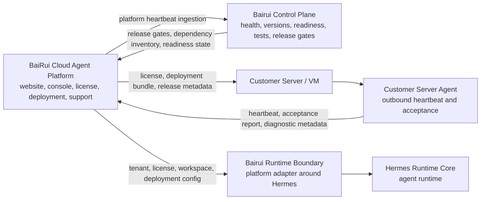

# BaiRui Cloud Agent Platform

This repository is the BaiRui platform-side control and delivery system.

It is aligned with the framework defined in
`LUTAO581314/BaiRui-agent`:

- five business layers in the agent framework;
- one cross-cutting Bairui Control Plane;
- Hermes Agent as the Core Runtime Layer;
- Bairui Runtime Boundary as the platform adapter around Hermes;
- OpenClaw as a service integration candidate/reference;
- BaiLongma as a channel and UI reference.

This repository does not own the Hermes runtime. It owns the cloud platform,
customer delivery, license, deployment, server-agent, and platform-to-control
plane contracts.

## Product Role

`BaiRui-cloud-agent-platform` owns:

- official website;
- customer console;
- admin console;
- organization and member management;
- plans, subscriptions, and orders;
- license generation and validation workflow;
- deployment wizard and customer delivery bundles;
- server registration;
- server-agent protocol;
- heartbeat and acceptance evidence;
- version and release inventory;
- Bairui Control Plane platform heartbeat ingestion;
- support tickets and diagnostic bundle workflow.

`BaiRui-cloud-agent-platform` does not own:

- Hermes runtime internals;
- agent loop, model calls, tool calls, memory runtime, or skills;
- OpenClaw channel implementation internals;
- BaiLongma UI implementation internals;
- customer business chat content;
- customer Obsidian vault content;
- third-party model API keys;
- customer connector tokens;
- unrestricted remote shell control of customer servers.

## Platform Relationship To The Agent Framework



## Repository Direction

Target structure:

```text
BaiRui-cloud-agent-platform/
  apps/
    web/                 # website, customer console, admin console
  packages/
    db/                  # platform database schema and migrations
    deployment/          # customer deployment bundle generation
    license/             # license generation and validation helpers
    server-protocol/     # heartbeat, acceptance, platform protocol
    ui/                  # shared platform UI components
  server-agent/
    installer/
    agent/
    systemd/
  infra/
    docker/
    nginx/
    scripts/
  docs/
    00-platform-rebuild-plan.md
    01-server-management-plan.md
    02-license-and-deployment-flow.md
    03-hermes-platform-contract.md
    07-bairui-framework-alignment.md
```

## Recommended Technical Direction

Platform:

- Next.js;
- TypeScript;
- PostgreSQL;
- Prisma or Drizzle;
- Tailwind CSS;
- shadcn/ui;
- Auth.js or equivalent auth layer;
- Docker Compose;
- GitHub Actions;
- Playwright.

Server management:

- customer-side VPS, VM, or managed deployment;
- Docker Compose inside customer environment;
- outbound server heartbeat;
- no unauthenticated public control port;
- white-listed server actions only;
- diagnostic bundle upload only after customer action;
- no customer business data uploaded by default.

## P0 Platform Deployment

Run the local deployment check:

```sh
sh infra/platform/scripts/deploy-platform.sh
```

For production, copy `infra/platform/env.example` to a protected server path
such as `/etc/bairui/platform.env`, set real values, then run the script with
`BAIRUI_INSTALL_SYSTEMD=1` as root to install the systemd service.

When `BAIRUI_PLATFORM_DATABASE_URL` is set, the script runs `npm run
db:migrate` by default. Keep `BAIRUI_RUN_MIGRATIONS=1` for server rebuilds so
PostgreSQL tables such as `server_acceptance_reports` are created before the
API starts.

After startup, check `GET /ready` before customer deployment or acceptance.

Generate a customer deployment bundle:

```sh
npm run deployment:bundle:print -- --organization-id=org_demo --license-id=lic_demo --server-id=srv_demo --platform-url=https://platform.example.com
```

Run the full release flow:

```sh
BAIRUI_LICENSE_SECRET=change-me npm run delivery:release -- --organization-id=org_demo --license-id=lic_demo --server-id=srv_demo --platform-url=https://platform.example.com --out=./tmp/delivery/org_demo-srv_demo
```

Run customer-server acceptance after Hermes and server-agent environment files
are installed:

```sh
npm run server-agent:acceptance
```

## Implemented Platform Foundation

- server-side `user`, `org_admin`, and `platform_admin` authorization;
- organization-scoped users, agents, conversations, messages, audit, servers,
  licenses, releases, and control-plane snapshots;
- separate user and administrator pages, APIs, and JavaScript delivery;
- signed platform-to-runtime requests and outbound server heartbeat;
- Ed25519 licenses and hash-verified delivery bundles;
- PostgreSQL migrations, Docker deployment, and GitHub CI container builds.

Provider credentials and customer connector tokens remain deployment secrets.
CI verifies fixtures and authorization boundaries without invoking paid models.

