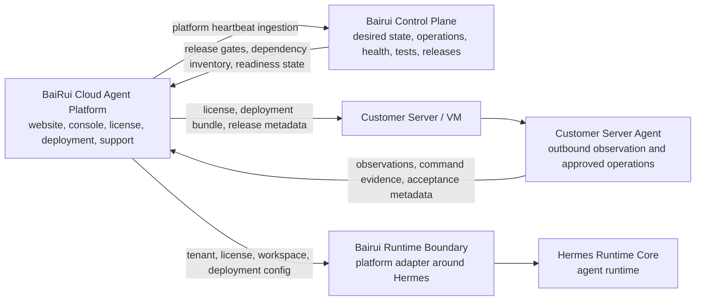

# BaiRui Cloud Agent Platform

This repository is the BaiRui platform-side control and delivery system.

It is aligned with the framework defined in
`LUTAO581314/BaiRui-agent`:

- five business layers in the agent framework;
- one cross-cutting Bairui Control Plane;
- Hermes Agent as the Core Runtime Layer;
- Bairui Runtime Boundary as the platform adapter around Hermes;
- OpenClaw as a service integration candidate/reference;
- BaiLongma as a channel and UI reference.

This repository does not own the Hermes runtime. It owns the cloud platform,
customer delivery, license, deployment, server-agent, and platform-to-control
plane contracts.

The cross-team implementation contract is documented in
`docs/20-platform-agent-integration-guide.md`. Platform work must preserve its
identity, data-plane, control-plane, memory, and administrator boundaries.

## Product Role

`BaiRui-cloud-agent-platform` owns:

- official website;
- customer console;
- admin console;
- organization and member management;
- plans, subscriptions, and orders;
- license generation and validation workflow;
- deployment wizard and customer delivery bundles;
- server registration;
- server-agent protocol;
- heartbeat and acceptance evidence;
- version and release inventory;
- Bairui Control Plane platform heartbeat ingestion;
- desired and observed deployment state;
- operational approvals, command leases, tests, releases, backups, incidents,
  and audit workflows;
- support tickets and diagnostic bundle workflow.

`BaiRui-cloud-agent-platform` does not own:

- Hermes runtime internals;
- agent loop, model calls, tool calls, memory runtime, or skills;
- OpenClaw channel implementation internals;
- BaiLongma UI implementation internals;
- customer business chat content;
- customer Obsidian vault content;
- third-party model API keys;
- customer connector tokens;
- unrestricted remote shell control of customer servers.
- prompts, Agent tasks, model/tool decisions, runtime memory operations, or any
  other Hermes execution behavior through the control plane.

## Platform Relationship To The Agent Framework



## Repository Direction

Target structure:

```text
BaiRui-cloud-agent-platform/
  apps/
    web/                 # website, customer console, admin console
  packages/
    db/                  # platform database schema and migrations
    deployment/          # customer deployment bundle generation
    license/             # license generation and validation helpers
    server-protocol/     # heartbeat, acceptance, platform protocol
    ui/                  # shared platform UI components
  server-agent/
    installer/
    agent/
    systemd/
  infra/
    docker/
    nginx/
    scripts/
  docs/
    00-platform-rebuild-plan.md
    01-server-management-plan.md
    02-license-and-deployment-flow.md
    03-hermes-platform-contract.md
    07-bairui-framework-alignment.md
```

## Recommended Technical Direction

Platform:

- Next.js;
- TypeScript;
- PostgreSQL;
- Prisma or Drizzle;
- Tailwind CSS;
- shadcn/ui;
- Auth.js or equivalent auth layer;
- Docker Compose;
- GitHub Actions;
- Playwright.

Database policy:

- PostgreSQL is the default and authoritative production database;
- `MemoryPlatformRepository` is only for tests and disposable local runs;
- new platform state and business schemas default to PostgreSQL migrations;
- Obsidian is a Markdown/Vault interchange format, not a replacement for PG;
- SQLite used internally by an upstream stays behind that upstream's adapter.

Channel policy:

- Feishu, WeChat Official and QQ run in a separate Channel Worker;
- the Worker uses a dedicated signed machine identity, never Runtime credentials;
- PostgreSQL inbox/outbox leases and durable receipts provide at-least-once delivery;
- a channel is connected only after its real vendor handshake succeeds.

Server management:

- customer-side VPS, VM, or managed deployment;
- Docker Compose inside customer environment;
- outbound server heartbeat;
- no unauthenticated public control port;
- white-listed server actions only;
- diagnostic bundle upload only after customer action;
- no customer business data uploaded by default.

## Current Platform Deployment

Prepare protected production variables from `infra/.env.example`, then deploy:

```sh
docker compose --env-file infra/.env -f infra/docker-compose.yml up -d --build
```

The platform binds only to `127.0.0.1:3000`. Put
`infra/nginx/bairui.conf` in front of it for HTTPS. The container waits for
PostgreSQL and applies migrations before starting the web process.
The Channel Worker binds to `127.0.0.1:8790`; Nginx sends only the public
`/callbacks/wechat/` path to it. See
[`docs/23-durable-channel-bridge.md`](docs/23-durable-channel-bridge.md) for the
credential, callback, health and delivery contract.

After startup, check `GET /ready` before customer deployment or acceptance.

Generate a customer deployment bundle:

```sh
npm run deployment:bundle:print -- --organization-id=org_demo --license-id=lic_demo --server-id=srv_demo --platform-url=https://platform.example.com
```

Run the full release flow:

```sh
BAIRUI_LICENSE_PRIVATE_KEY="<protected PEM>" npm run delivery:release -- --organization-id=org_demo --license-id=lic_demo --server-id=srv_demo --platform-url=https://platform.example.com --plan=business --expires-at=2030-01-01T00:00:00.000Z --out=./tmp/delivery/org_demo-srv_demo
```

Run customer-server acceptance after Hermes and server-agent environment files
are installed:

```sh
npm run server-agent:acceptance
```

## Implemented Platform Foundation

- server-side `user`, `org_admin`, and `platform_admin` authorization;
- organization-scoped users, agents, conversations, messages, audit, servers,
  licenses, releases, and control-plane snapshots;
- separate user and administrator pages, APIs, and JavaScript delivery;
- signed platform-to-runtime requests and outbound server heartbeat;
- Ed25519 licenses and hash-verified delivery bundles;
- PostgreSQL migrations, Docker deployment, and GitHub CI container builds.

The current production control path is observation-only. The complete protocol,
PostgreSQL control model, security boundary, and delivery sequence are defined
in `docs/10-control-plane-architecture.md` through
`docs/13-control-plane-operations.md`. A configuration or release is not
reported as applied until the server agent executes and verifies it.

Provider credentials and customer connector tokens remain deployment secrets.
CI verifies fixtures and authorization boundaries without invoking paid models.

