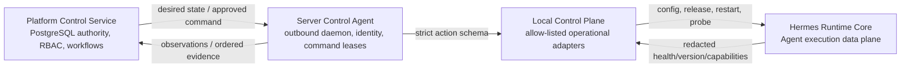

# Bairui Control Plane Architecture

The Bairui Control Plane governs deployments. Hermes governs Agent runs. This
separation is mandatory and applies to the API, credentials, database, workers,
server agent, audit, and UI.

## Ownership boundary

Hermes owns prompts, conversations, agent tasks, planning, model and tool
selection/execution, skills, runtime approvals, runtime memory, replies, and
artifacts. The control plane must not duplicate, intercept, or redirect those
capabilities.

The control plane owns deployment identity, desired and observed state,
configuration revisions, operational approvals, command leasing, health and
test evidence, releases, backups, upstream drift, incidents, and operational
audit. It may configure, probe, restart, update, or roll back the Hermes service
without making a decision inside an Agent run.

The platform never calls the Hermes Runtime API with a control credential. The
server agent does not expose an unauthenticated inbound management port and
does not implement a generic remote shell.

## Components

### Platform Control Service

- PostgreSQL authority for desired state and workflow state;
- command queue, leases, retries, cancellation, expiry, and idempotency;
- RBAC, risk classification, approval, and separation of duties;
- configuration, release, test, upstream, backup, incident, and fleet domains;
- transactional outbox, workers, dead-letter handling, and audit hash chain.

### Server Control Agent

- unique deployment identity with enrollment, rotation, and revocation;
- long-running outbound lease and event loop;
- durable local replay journal and ordered event sequence;
- fixed action adapters with timeout, least privilege, and post-action probe;
- self-update through the same signed release discipline.

### Local Control Plane

- connects operational probes from all five BaiRui layers;
- compares desired state with observations;
- invokes only the versioned actions in the shared protocol;
- emits redacted evidence and applies rollback policy;
- has no `RuntimeRequest`, prompt, task, tool, model, skill, or memory action.

## Current implementation

The deployed implementation currently ingests observation snapshots and shows
them to authorized administrators. The outbound Server Agent leases commands,
records idempotent receipts, and executes only the Supervisor action allowlist.
The formal protocol and PostgreSQL model are being introduced before command
workers so the future implementation cannot blur the Hermes boundary.
