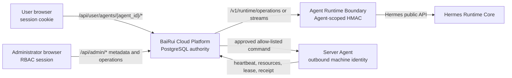

# BaiRui Cloud Platform And Agent Integration Guide

This is the implementation handoff for the team building the BaiRui Cloud
Agent Platform. It defines how the cloud platform connects to each user-owned
`bairui-agent` without taking over Hermes execution or exposing Agent secrets
to the browser or administrator console.

## 1. System roles

| Component | Authority | Must not own |
| --- | --- | --- |
| BaiRui Cloud Agent Platform | accounts, organizations, Agent ownership, PostgreSQL, model policy, licenses, desired state, admin UI, audit | Hermes loop, tools, prompt decisions, runtime memory |
| BaiRui Runtime Boundary | Agent identity validation, signed operation envelope, Hermes API adaptation, Agent-scoped memory projection | cloud users, billing, global fleet policy |
| Hermes Runtime Core | sessions, messages, runs, tools, skills, jobs, active `MEMORY.md` and `USER.md` | platform RBAC, fleet control, subscriptions |
| Server Agent and Supervisor | outbound heartbeat, command lease, fixed operational adapters, container lifecycle | prompts, arbitrary shell, SQL, user conversations |
| BaiLongma UI adapter | user interaction, graph rendering, Hermes SSE event mapping | Agent loop, SQLite authority, model credentials |

PostgreSQL `obsidian_notes` is the canonical long-term memory authority. The
BaiLongma graph and Hermes memory files are projections of the same Agent-owned
records.

## 2. Required connection topology



There is no browser-to-Hermes connection. There is no administrator credential
that can call the Runtime data plane. The Server Agent opens outbound HTTPS
requests; the customer host does not expose a public management shell.

## 3. Identities and credentials

| Identity | Scope | Authentication | Storage |
| --- | --- | --- | --- |
| User session | one authenticated user | signed HTTP-only session cookie | browser cookie only |
| Runtime route | one Agent | Runtime shared secret with timestamp, nonce, HMAC | encrypted Agent config revision |
| Agent Runtime machine | one Agent | `x-bairui-machine-id` plus signed machine request | hash in platform PostgreSQL, token on Agent host |
| Server machine | one server | `x-bairui-machine-id` plus signed machine request | hash in platform PostgreSQL, token on server host |
| Hermes API server | one Hermes instance | bearer key used only by Runtime Boundary | Agent host secret file or secret manager |
| Provider | organization or channel | encrypted API key envelope | platform secret vault, never browser-readable |

Every protocol uses a different credential. Tokens, shared secrets, provider
keys, Hermes keys, license private keys, and database passwords must never be
returned by `/api/user/*`, `/api/admin/*`, telemetry, receipts, screenshots, or
diagnostic bundles.

## 4. User data plane

The browser addresses only an Agent owned by the authenticated user:

```text
/api/user/agents/{agent_id}/sessions
/api/user/agents/{agent_id}/sessions/{session_id}/messages
/api/user/agents/{agent_id}/sessions/{session_id}/chat/stream
/api/user/agents/{agent_id}/runs
/api/user/agents/{agent_id}/jobs
/api/user/agents/{agent_id}/skills
/api/user/agents/{agent_id}/memory-notes
/api/user/agents/{agent_id}/memory-sync
/api/user/agents/{agent_id}/channels
/api/user/agents/{agent_id}/hotspots
/api/user/agents/{agent_id}/usage
```

Before forwarding any Runtime operation, the platform must verify both:

```text
agent.organization_id == session.organization_id
agent.owner_user_id == session.user_id
```

The platform resolves that Agent's private Runtime endpoint and shared secret,
then signs one of these Runtime Boundary requests:

```text
POST /v1/runtime/operations
POST /v1/runtime/streams
```

Runtime request headers:

```text
content-type: application/json
x-bairui-timestamp: <unix milliseconds>
x-bairui-nonce: <unique nonce>
x-bairui-signature: HMAC-SHA256(timestamp + "." + nonce + "." + raw body)
```

The envelope always includes `organization_id`, `agent_id`, `user_id`, role,
operation, trace id, and creation time. Runtime Boundary must reject identity
mismatches, stale timestamps, replayed nonces, unsupported operations, and an
invalid signature.

## 5. Memory contract

Memory follows this one-authority model:

```text
PostgreSQL obsidian_notes
  -> BaiLongma graph nodes and [[wikilink]] edges
  -> bounded projection
  -> Hermes memories/MEMORY.md and memories/USER.md
```

Platform responsibilities:

- store tenant, user, and Agent ownership for every Obsidian note;
- retain Markdown, frontmatter, kind, importance, target, revision, and sync state;
- build the bounded projection and show excluded/conflict states to the owner;
- call `memory.snapshot` before `memory.apply`;
- use the snapshot digest for optimistic conflict protection;
- import Hermes-native entries as provenance-marked Obsidian notes;
- never include note bodies in Control Plane or admin telemetry.

Runtime responsibilities:

- expose only `memory.snapshot` and `memory.apply` for memory synchronization;
- mount only the current Agent's `hermes-data/memories` directory;
- atomically write Hermes `MEMORY.md` and `USER.md`;
- reject a changed digest instead of silently overwriting memory;
- never expose another Agent's workspace.

Hermes limits currently enforced by the projection are 2,200 characters for
`MEMORY.md` and 1,375 characters for `USER.md`.

### 5.1 Agent-owned third-party authorization

User-supplied Firecrawl, SearXNG, FunASR, MinerU, and permitted personal model
credentials are stored in PostgreSQL `agent_authorizations`. Ownership is bound
by `organization_id`, `user_id`, and `agent_id`; the credential value is an
AES-256-GCM envelope and is never returned by `/app` or `/admin` APIs.

The user manages metadata and encrypted values through:

```text
GET    /api/user/agents/{agent_id}/authorizations
POST   /api/user/agents/{agent_id}/authorizations
DELETE /api/user/agents/{agent_id}/authorizations/{authorization_id}
```

An adapter inside the matching Agent Runtime resolves a stored credential with
its independent signed machine identity:

```text
POST /api/internal/runtime/agents/{agent_id}/authorizations/{authorization_id}/resolve
```

The platform verifies method, path, body, timestamp, nonce, signature, active
Runtime credential, and matching Agent id. Resolution is audited without the
credential body. Revocation clears the encrypted envelope, so an old reference
cannot be resolved again. Personal model credentials additionally require the
organization policy `user_custom_keys_allowed=true`.

## 6. Control plane and Server Agent

The Server Agent calls the cloud platform over outbound HTTPS:

| Endpoint | Machine identity | Purpose |
| --- | --- | --- |
| `POST /api/internal/control-plane/heartbeats` | Agent Runtime credential | health, versions, component summaries, usage rollup |
| `POST /api/internal/control-plane/resources` | Server credential | CPU, memory, storage, OS, container metadata |
| `POST /api/internal/control-plane/commands/lease` | Server credential | lease approved operational commands |
| `POST /api/internal/control-plane/commands/{id}/receipts` | Server credential | accepted, running, succeeded, failed evidence |
| `POST /api/internal/control-plane/snapshots` | legacy ingest token during migration | compatibility snapshot only |

Machine requests bind method, path, timestamp, nonce, and SHA-256 body hash.
The platform persists nonces and rejects replay, clock skew, revoked identity,
wrong machine ownership, invalid state transitions, and duplicate sequence.

The Control Plane action allowlist is defined in
`packages/server-protocol/control-plane.mjs`. It contains deployment, probe,
contract test, configuration, backup, release, restart, and credential actions.
It must never contain prompt, conversation, task, model, tool, skill, memory,
runtime, shell, script, or SQL actions.

## 7. Agent initialization sequence

```text
1. Platform creates organization, user, Agent, and uninitialized Runtime row.
2. Administrator configures an encrypted provider channel and model policy.
3. Owner requests Agent initialization.
4. Platform creates deployment, Agent-scoped config revision, four encrypted secrets,
   and a deployment.provision command.
5. Server Agent leases the command and Supervisor starts the Runtime Boundary and Hermes.
6. Server Agent returns accepted/running/succeeded receipts.
7. Runtime stays starting until a healthy Agent heartbeat arrives.
8. Platform changes the Agent to ready and enables chat, runs, jobs, skills, and memory sync.
```

An accepted HTTP request is not a successful deployment. The UI must use the
receipt and heartbeat state machine and display `uninitialized`, `provisioning`,
`starting`, `ready`, `degraded`, `offline`, `failed`, or `suspended` accurately.

## 8. Administrator boundary

`/admin` manages all Agents through metadata and operational workflows. It may
display owners, Runtime status, versions, CPU, memory, storage, usage totals,
alerts, commands, releases, backups, channels, and configuration revision
metadata.

It does not receive conversation bodies, prompts, files, Obsidian note bodies,
Hermes memory content, provider keys, connector secrets, Runtime shared
secrets, or Hermes API keys. Sensitive-access grants are explicit, temporary,
audited, and do not create a general Runtime credential.

## 9. Error contract

Platform and UI implementations must preserve stable machine-readable errors:

| Error | HTTP | Meaning |
| --- | --- | --- |
| `agent_not_found` | 404 | Agent does not belong to the current user |
| `agent_not_ready` | 409 | initialization is incomplete |
| `model_not_configured` | 409 | no allowed configured provider/model |
| `model_not_allowed` | 400 | user selection violates model policy |
| `runtime_route_unavailable` | 503 | private Agent Runtime route is absent |
| `runtime_offline` | 503 | heartbeat is stale or Runtime is unavailable |
| `quota_exhausted` | 429 | organization or Agent policy limit reached |
| `memory_projection_conflict` | 409 | Hermes memory changed after snapshot |
| `invalid_agent_credential` | 401 | machine identity or signature failed |
| `forbidden` | 403 | authenticated principal lacks permission |

Do not turn these failures into fake successful messages in BaiLongma. The
frontend must show the operational blocker and retain the user's unsent input.

## 10. Platform team implementation checklist

- Use PostgreSQL migrations as the production source of truth.
- Keep `agent_id`, `owner_user_id`, and `organization_id` on every Agent record.
- Implement the existing session and RBAC contract before adding business UI.
- Resolve Runtime routes server-side; never publish private endpoints or keys.
- Preserve raw request bodies when calculating signatures.
- Persist nonce replay protection and idempotency keys transactionally.
- Treat command receipts plus observations as the completion condition.
- Keep administrator views metadata-only by default.
- Keep all user APIs Agent-scoped and ownership checked.
- Run `npm run verify`, PostgreSQL migration checks, and
  `npm run test:browser:remote` in GitHub Actions.
- Coordinate any Runtime operation or Control Plane action change with the
  `BaiRui-agent` contract owner before merging.

The current executable references are:

```text
apps/web/app.mjs
packages/server-protocol/runtime-client.mjs
packages/server-protocol/control-plane.mjs
packages/security/machine-request.mjs
server-agent/control-client.mjs
server-agent/supervisor.mjs
packages/memory/obsidian-note.mjs
```
