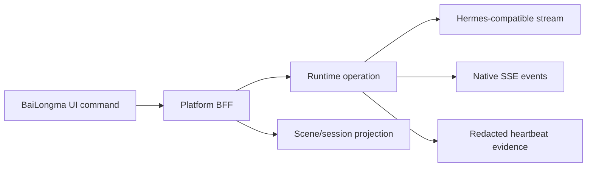

# U00-03 Vertical Slice Evidence

This document defines the machine-checkable evidence for the first complete
user capability: `web-chat`.

The fixture is deliberately split between the existing remote browser fixture,
the platform HTTP/BFF routes, the Runtime operation boundary, the scene and
session stores, and the control-plane heartbeat projection. A green unit test
or a page that renders is not sufficient evidence by itself.

## Evidence chain



The required assertions are:

1. An owner can issue a Scene intent and receive a revisioned Scene patch.
2. The BFF calls `sessions.chat.stream` for the owner's Agent.
3. Native `run.started`, `assistant.delta`, `assistant.completed` and
   `run.completed` events reach the client without being synthesized by the
   Platform.
4. The Runtime session store contains the completed assistant message and the
   Platform Scene store contains the revisioned projection event.
5. A peer receives `404` for the owner's Scene, proving owner scoping at the
   user boundary.
6. The control-plane evidence contains status and numeric telemetry only; it
   never contains user or assistant message bodies.

## Commands and artifacts

The Platform CI runs:

```text
node --test tests/u00-03-vertical-slice.test.mjs
```

It writes `test-results/u00-03/web-chat.json`. The PostgreSQL job separately
proves the same storage contracts against PostgreSQL migrations `001` through
`020`; its result must remain a separate artifact and must not be confused with
the memory browser fixture.

The report is evidence for `U00-03`, not a release approval. `GATE-U00` still
requires the three repositories to consume the same fixed Contracts version,
owner-scope coverage, and this complete five-layer capability chain.
